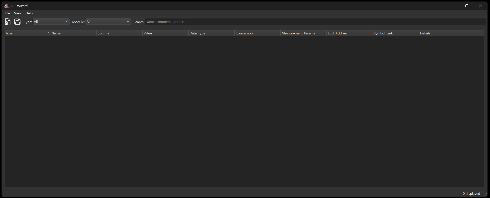
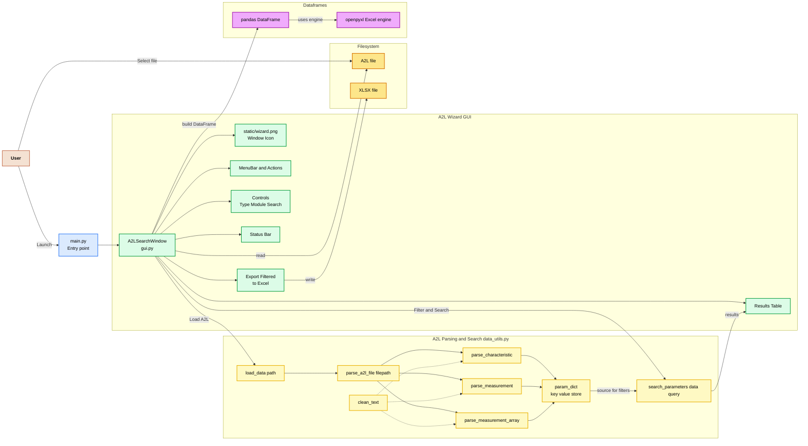

# A2L-Wizard

<p align="center">
  
</p>

<div align="center">
A2L Wizard is a cross-platform GUI application for browsing, searching, and exporting parameters from `.a2l` files. 
</div>

<p align="center">
It provides an intuitive user interface with mediocre filtering, search, and export capabilities.
</p>


---

## Features

### Interactive A2L Browser

- Load and parse `.a2l` files to display:
  - **Characteristics**
  - **Measurements**
  - **Measurement Arrays**
- Filter parameters by **type** and **module**.
- Live text search in parameter names and comments.
- Toggle column visibility via right-click on table headers.
- Export filtered data to `.xlsx` format.

<p align="center">
  
</p>

## A2L Wizard Data Flow and Architecture

- **A2L Wizard** is a desktop application for loading, browsing, filtering, and exporting data from `.a2l` files.
- It features a GUI for interactive parameter search, a data parsing layer that processes A2L file structures into structured data, and export capabilities to Excel.
- The diagram below illustrates the high-level architecture, showing how user actions flow through the GUI, data processing logic, and file operations.




## Project Layout

```plaintext
A2L-Wizard/
├── data_utils.py       # A2L parsing and search logic
├── gui.py              # PySide6 GUI implementation
├── main.py             # Application entry point
├── requirements.txt    # Dependency list
├── static/
│   └── wizard.png      
└── README.md
````

---

## Installation

### Prerequisites

- Python 3.10 or newer (tested with Python 3.11)
- Compatible with Windows, macOS, and Linux

### Install Dependencies

```bash
pip install -r requirements.txt
```

---

## Usage

Start the application:

```bash
python main.py
```

### Main Functions

1. **Load .a2l File**
   Use *File → Load* or click **Load .a2l**.
2. **Filter Data**

   - Select **Type** from the dropdown.
   - Select **Module** from the dropdown.
   - Enter a **Search** term.
3. **Export Results**
   Click **Export Filtered** to save the currently visible table contents as an Excel file.

---

## Dependencies

`requirements.txt`:

```plaintext
pandas>=2.0.0
PySide6>=6.6.0
openpyxl>=3.1.0
```

---

## License

This project is licensed under the WTFPL

